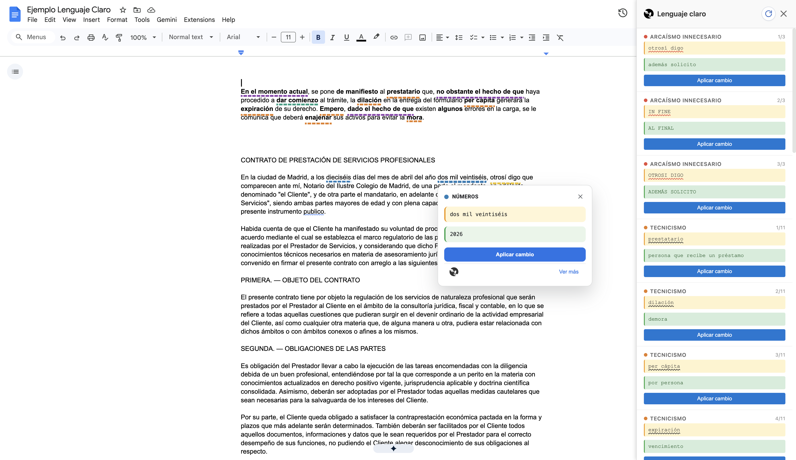

# Lenguaje claro - Extensión Chrome para Google Docs



Una extensión de Chrome que se enfoca en reglas de escritura jurídica en el marco del lenguaje claro.

Revisa y mejora la escritura en Google Docs, detectando problemas de estilo y sugiriendo mejoras. Es similar a Grammarly, ProWritingAid o Hemingway App pero pensada para profesionales del derecho.

No envía datos a servidores externos, ni usa modelos de IA. Funciona 100% en el navegador, y es de código abierto. Por esto, se puede trabajar en documentos sensibles sin preocupaciones de privacidad.

## Características

### Reglas de Escritura

1. **Arcaísmos innecesarios** - Detecta y sugiere reemplazos para términos obsoletos del lenguaje jurídico
   - Ejemplos: "in fine" → "al final", "a sensu contrario" → "en sentido contrario", "otrosí digo" → "además solicito"

2. **Tecnicismos** - Reemplaza términos técnicos legales por lenguaje llano y accesible
   - Ejemplos: "prestatario" → "persona que recibe un préstamo", "mora" → "retraso", "enajenar" → "vender"

3. **Vaguedades** - Detecta expresiones imprecisas e indica qué tipo de información concreta debería reemplazarlas
   - Ejemplos: "mucho" → cifra o porcentaje, "en alguna medida" → magnitud específica
   - _Limitación_: no puede sugerir texto exacto porque la información precisa depende del contexto del documento

4. **Rodeos innecesarios** - Sustituye frases extensas por alternativas concisas
   - Ejemplos: "en el momento actual" → "ahora", "a fin de" → "para", "de conformidad con" → "según"

5. **Voz pasiva** - Detecta construcciones pasivas y sugiere reestructurar en voz activa más directa
   - Ejemplo: "fue interpuesto el recurso" → sugiere forma activa según el participio detectado
   - _Limitación_: no siempre puede reconstruir la oración completa sin conocer el sujeto real; las sugerencias pueden requerir ajuste manual

6. **Queísmo y dequeísmo** - Detecta el uso incorrecto u omisión de "de que" con patrones curados y contexto local
   - Detecta queísmo ("me alegra que vengas" cuando corresponde "de que") y dequeísmo ("pienso de que" cuando corresponde "que")
   - _Limitación_: algunos casos son ambiguos sin análisis sintáctico profundo; puede generar falsos positivos en oraciones complejas

7. **Nominalización** - Detecta construcciones sustantivadas y sugiere usar el verbo directamente
   - Ejemplos: "poner en consideración" → "considerar", "dar comienzo" → "comenzar", "realizar una inspección" → "inspeccionar"

8. **Números** - Sugiere reemplazar números escritos con palabras por dígitos, y números romanos por arábigos
   - Ejemplos: "treinta y dos" → "32", "Artículo XIV" → "Artículo 14"
   - _Limitación_: omite "uno/una" en contextos ambiguos (artículo indeterminado vs. numeral) para evitar falsos positivos

> **Nota sobre las limitaciones generales del análisis basado en regex:** al no usar servidores externos ni modelos de IA con NLP (procesamiento de lenguaje natural), todas las reglas operan con patrones de texto rígidos aplicados localmente en el navegador. Esto garantiza privacidad total pero implica que el sistema no comprende la estructura gramatical a fondo como un modelo de NLP, ni el significado de las oraciones. Como resultado, algunas sugerencias requieren revisión manual, ciertos casos ambiguos pueden generar falsos positivos, y reglas como voz pasiva o vaguedades no pueden reconstruir ni proponer el texto exacto sin conocer el contexto semántico del documento.

## Instalación y Uso

### 1. Preparar la extensión

```bash
# Navegar a la carpeta del proyecto
cd lenguaje-claro

# Asegurarse de usar Node 22
source ~/.nvm/nvm.sh && nvm use 22
```

### 2. Generar `dist/`

```bash
npm run build
```

Este paso genera `dist/manifest.json`, bundlea los scripts de la extensión y copia los assets estáticos necesarios a `dist/`.

Durante desarrollo podés dejar recompilando en segundo plano:

```bash
npm run watch
```

`watch` actualiza los bundles y los artefactos estáticos en `dist/`, pero Chrome igual requiere recargar la extensión y normalmente también la pestaña de Google Docs para tomar los cambios.

### 3. Cargar la extensión en Chrome

1. Abrir Chrome y navegar a `chrome://extensions`
2. Activar "Modo de desarrollador" (esquina superior derecha)
3. Hacer clic en "Cargar extensión sin empaquetar"
4. Seleccionar la carpeta `lenguaje-claro/dist`

### 4. Configurar permisos en Google Cloud Console

La extensión usa la API de Google Docs para leer y escribir documentos. Es necesario:

1. Habilita Google Docs API con permisos de **lectura y escritura** en <https://console.cloud.google.com/apis/library?project=your-project-name>
2. En [Google Cloud Console - Credenciales](https://console.cloud.google.com/apis/credentials?project=your-project-name), dentro de OAuth Client IDs, configurar el **ID de la extensión** de Chrome (se obtiene desde `chrome://extensions` una vez cargada)

### 5. Usar la extensión

1. Abrir un documento en [Google Docs](https://docs.google.com)
2. La extensión se inicializará automáticamente
3. Aparecerá un panel flotante en la parte derecha del documento
4. Los problemas detectados aparecerán:
   - **Subrayados inline** sobre el documento
   - **Popup contextual al hover** con regla, texto y sugerencia
   - **Panel lateral sincronizado** con el overlay
5. Hacer clic en un subrayado o en un elemento del panel para fijar el popup

## Estructura del Proyecto

```
lenguaje-claro/
├── dist/                      # Artefactos generados que se cargan en Chrome
├── .nvmrc                     # Node.js v22
├── content/
│   ├── index.js               # Entry point bundleado del content script aislado
│   ├── content.js             # Orquestación principal
│   ├── reader.js              # Lee el texto de Google Docs
│   ├── highlighter.js         # Crea overlays visuales
│   └── panel.js               # Gestiona el panel flotante
├── rules/
│   ├── index.js               # Registro central de reglas
│   ├── arcaismos.js           # Regla 1
│   ├── voz-pasiva.js          # Regla 2
│   └── queismo.js             # Regla 3
├── panel/
│   ├── panel.html             # Template del panel
│   └── panel.css              # Estilos
└── README.md
```

## Desarrollo

### Agregar nuevas reglas

Para agregar una nueva regla de escritura:

1. Crear un archivo `rules/nueva-regla.js`
2. Exportar un objeto con la siguiente estructura:

```javascript
export const nuevaReglaRule = {
  id: "nueva-regla",
  nombre: "Nombre legible",
  descripcion: "Descripción de qué detecta",
  color: "#color-hex", // Color del subrayado

  detectar(texto) {
    const matches = [];
    // Lógica de detección...
    return matches; // Array de {id, inicio, fin, textoOriginal, sugerencia, regla, descripcion}
  },
};

export default nuevaReglaRule;
```

1. Importar la nueva regla en `rules/index.js` y agregarla al array `rules`
2. Correr `npm run build` o dejar `npm run watch` activo

### Tests

```bash
npm test
```

La suite actual valida que los patrones curados de queísmo/dequeísmo compilan y que los matchers clave siguen detectando los casos esperados.

Para validar la UI del panel con navegador real:

```bash
npm run test:e2e
```

Ese e2e monta una página fixture, ejecuta el flujo completo de análisis y verifica que el panel muestre issues, sugerencias y botones.

## Notas Técnicas

### Cómo funciona

- **Lectura**: Extrae el texto completo vía Google Docs API
- **Análisis**: Aplica cada regla usando regex y patrones de texto
- **Visualización**: Reconcilia el texto de la API con la capa accesible visible de Docs para dibujar overlays inline
- **Popup**: Muestra detalle contextual al hover y acciones al hacer click
- **Panel**: Muestra la lista de problemas y se sincroniza con el overlay

### Limitaciones Actuales

- Los cambios se aplican manualmente (copiar/pegar o Find & Replace)
- El sistema de detección es basado en regex (no usa NLP)
- Las sugerencias de voz pasiva son genéricas (requieren revisión manual)

## Roadmap

- [ ] Aplicación automática de cambios
- [ ] Configuración de reglas por el usuario
- [ ] Más reglas de escritura formal/jurídica
- [ ] Estadísticas de documento
- [ ] Sincronización de configuración

## Troubleshooting

### La extensión no aparece

- Verificar que `dist/` esté generado con `npm run build`
- Verificar que Chrome cargó `dist/` y no la raíz del proyecto
- Verificar que se está en `docs.google.com`
- Recargar la página (F5)
- Verificar la consola del navegador (F12 → Console) para mensajes de error

### No detecta problemas

- Verificar que el texto contiene los patrones esperados
- Revisar la consola para logs de depuración
- Verificar que la regla fue exportada e incluida en `rules/index.js`

### El panel no responde

- Cerrar y reabrír el panel haciendo clic en ✕
- Recargar la página

## Licencia

Proyecto educativo - Uso libre
